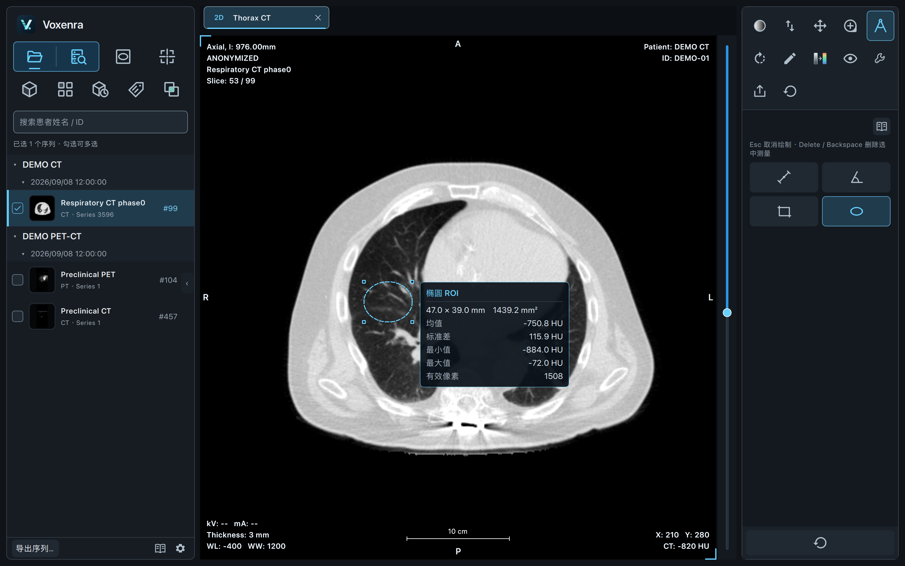
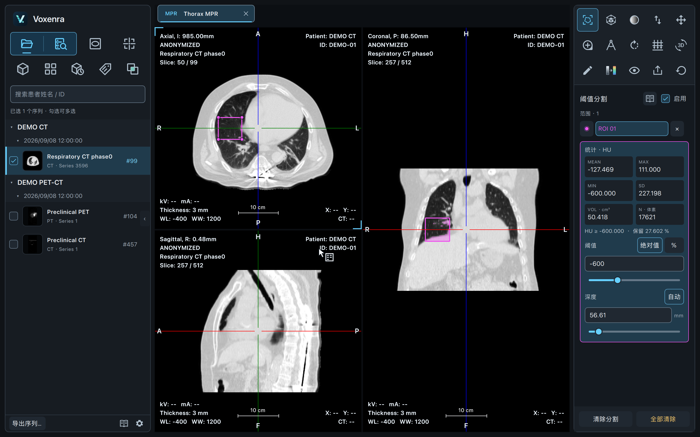
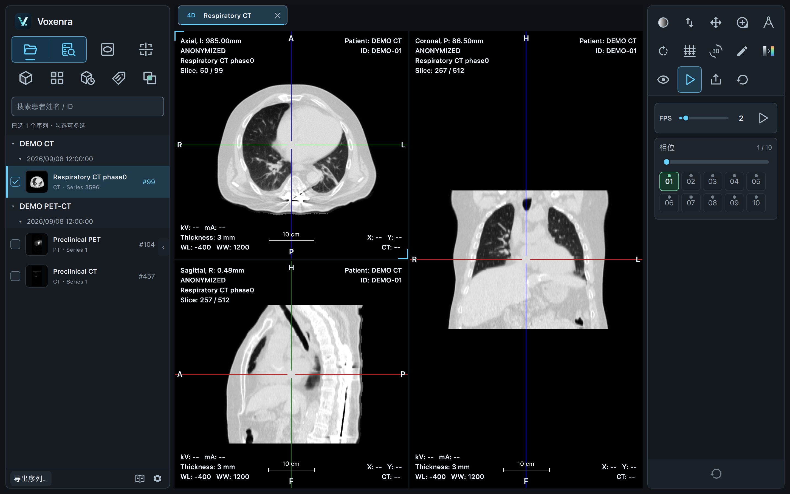
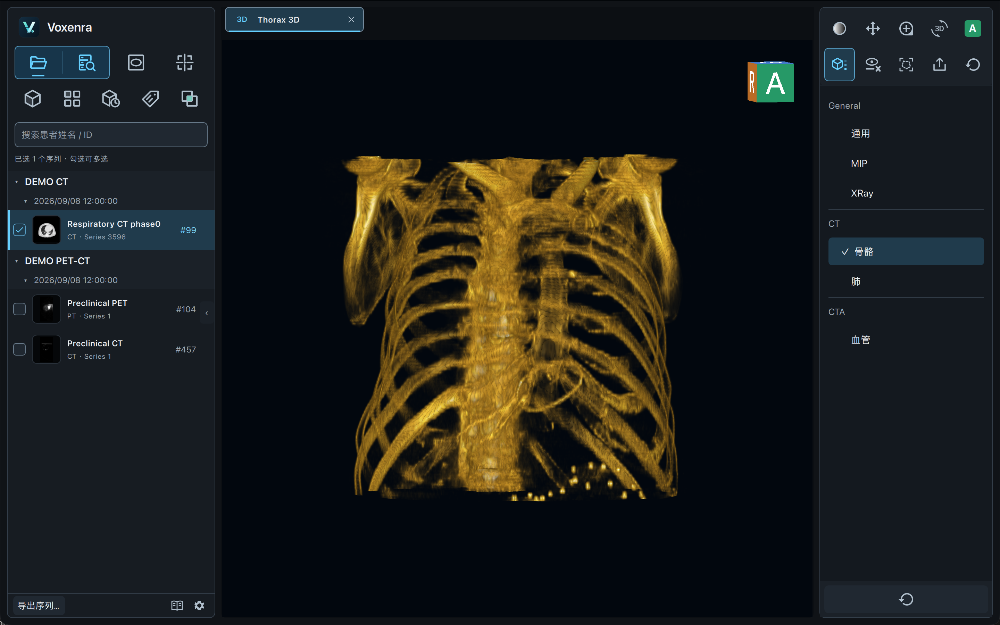
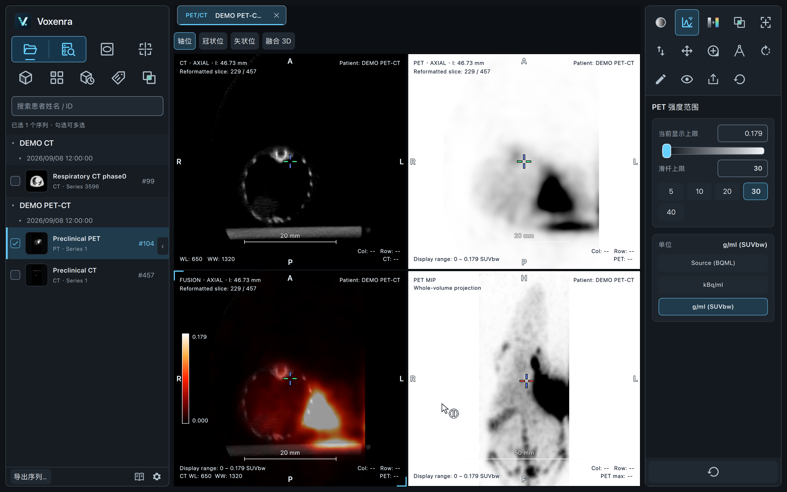
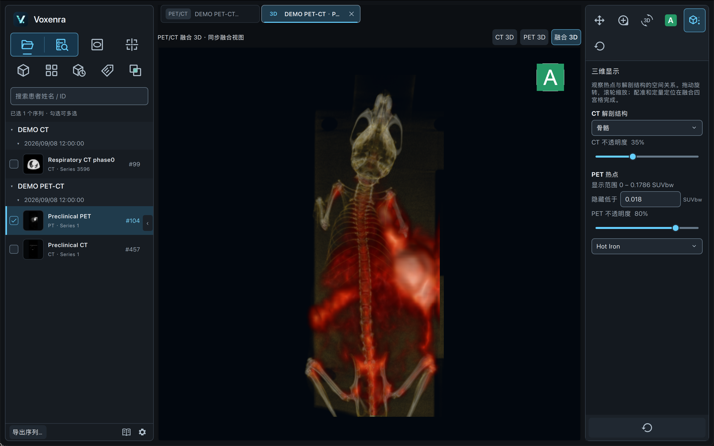

<p align="center">
  
</p>

# Voxenra

跨平台 DICOM 浏览器：2D 阅片、MPR、4D、三维体绘制与 PET/CT 融合。

## 下载

**[Voxenra v0.2.0](https://github.com/l5769389/qt-dicom-viewer/releases/tag/v0.2.0)**

| 平台 | 下载 |
| --- | --- |
| macOS · Apple Silicon | [DMG 安装包](https://github.com/l5769389/qt-dicom-viewer/releases/download/v0.2.0/Voxenra-0.2.0-macos-arm64.dmg) |
| Windows · x64 | [安装包](https://github.com/l5769389/qt-dicom-viewer/releases/download/v0.2.0/Voxenra-0.2.0-windows-x64-setup.exe) · [便携版](https://github.com/l5769389/qt-dicom-viewer/releases/download/v0.2.0/Voxenra-0.2.0-windows-x64-portable.exe) |

macOS 将应用拖入 Applications；Windows 运行安装包或直接打开便携版。Release 附带 SHA-256 校验文件。macOS 尚未公证，Windows 尚未签名。

## 主要功能

### 2D 阅片与测量

调窗、伪彩、缩放、翻转；长度、角度、矩形和椭圆 ROI；像素统计与标注。



### MPR、阈值分割与 VOI

轴位、冠状位、矢状位联动定位；斜面重建、厚层投影；阈值分割与球体 / 椭球 VOI 定量。



### 4D MPR

多时相 CT 联动重建、相位选择与循环播放，切换相位保留定位与显示设置。



### 三维体绘制

骨骼、肺、血管、MIP 等预设；交互旋转、去床板与自由裁剪。



### PET/CT 融合

CT、PET、FUSION 与 MIP 四格联动；独立 CT / PET 调窗、伪彩、融合比例与实时手动配准。按影像元数据提供可用的 SUV 或活度单位。



### 融合 3D

独立三维标签页切换 CT、PET、融合显示；调整透明度与 PET 阈值，并同步二维配准。



另支持序列平铺、DICOM Tag 查询、DICOMweb PACS 导入、PNG / DICOM 匿名导出，以及离线操作手册。

截图来自真实应用，使用 CT 和小动物 PET/CT 的脱敏展示副本；安装包不包含 DICOM 数据。

## 0.4.0 开发版

支持拖入本地 DICOM 文件、文件夹和 ZIP / RAR / 7z / TAR / GZ 等文件与文件夹压缩包，后台解压、扫描与取消；RAR 支持 RAR4、RAR5 和固实压缩，无需安装 WinRAR。窗宽 / 窗位最多保留一位小数。详见 [本地导入说明](docs/local-import.md)。上述下载链接仍对应已发布的 0.2.0，0.4.0 尚未发布安装包。

## 从源码运行

```bash
uv run voxenra
```

原 `uv run qt-dicom-viewer` 命令继续可用。开发与验证：

```bash
uv run --group dev pytest -q
uv run python tests/manual/smoke_3d.py
```

[打包与发布](docs/packaging.md) · [操作手册](docs/manual.md) · [PET 与配准](docs/pet-mpr-fusion.md) · [分割与 VOI](docs/mpr-segmentation-voi.md) · [PACS](docs/pacs.md) · [导出](docs/export.md)
