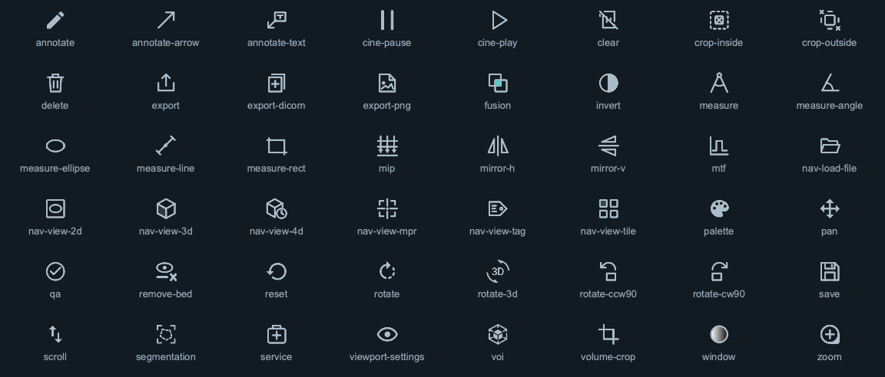
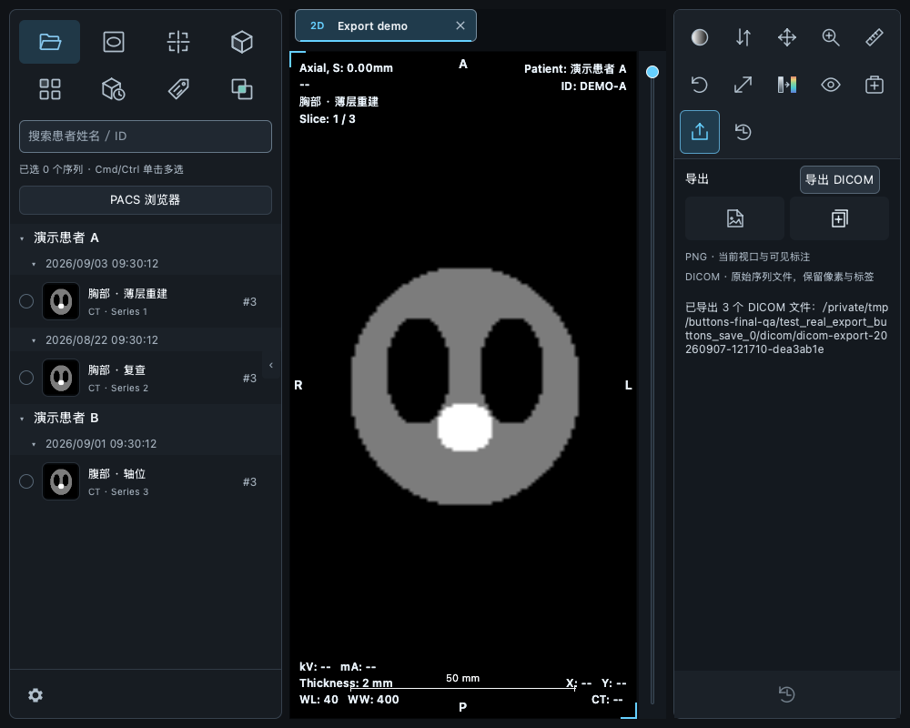
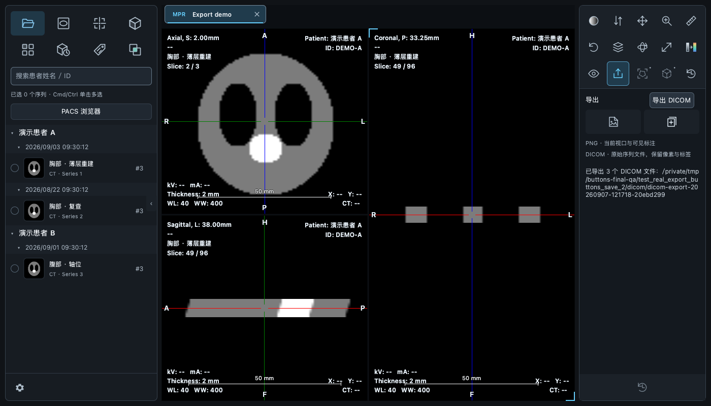
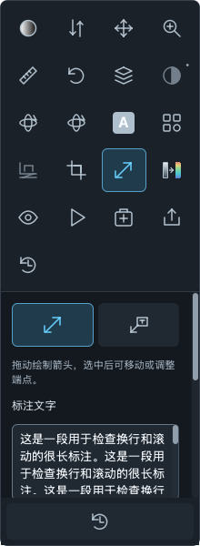
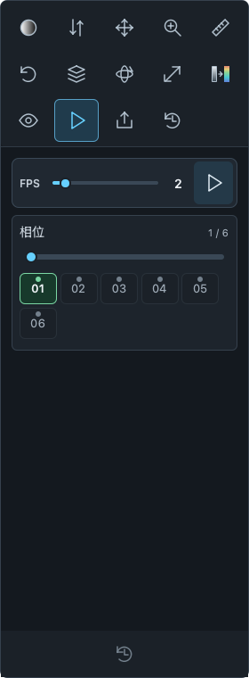
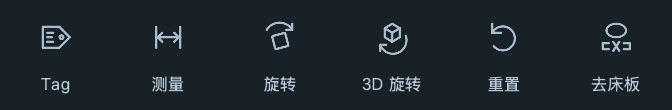
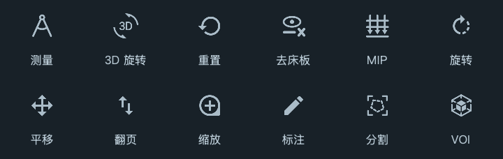
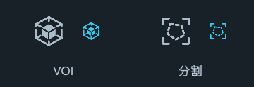

# 操作按钮复盘与导出验收

2026-09-07。覆盖左侧视图入口、右侧一级工具、二级操作、当前工具重置，以及标注、播放、裁剪、融合配准的动作按钮。

## 复盘结果与调整

| 区域 | 原有问题 | 调整 |
| --- | --- | --- |
| 工具图标 | PNG、实心图形、线条图形混用 | 39 个操作 SVG 加入统一渲染入口，与现有 8 个视图 SVG 共用状态着色和 DPR 渲染；伪彩继续使用矢量色带 |
| 一级／二级操作 | 背景、尺寸、焦点、文字显示不一致 | 共用 AppButton；图标为 24 px，主要工具高度 48 px；隐藏动作文字，提供悬浮提示和无障碍名称 |
| 标注、测量、旋转、裁剪 | 二级操作布局与按钮实现各自独立 | 使用同一 ToolActionButton，紧凑双列／双按钮布局 |
| 播放 | 独立小按钮，放大后挤占相位空间 | 同一按钮组件；FPS 行随按钮高度调整，相位区按完整行计算高度，预留滚动条空间 |
| 融合配准 | 动作按钮与其他工具风格不同 | 手动配准、中心对齐、重置、加载、保存统一为图标按钮 |
| 重置与焦点 | 当前工具重置样式独立，鼠标焦点容易混入选中态 | 使用公共组件；键盘 visualFocus 独立表达，鼠标点击不会保留第二个选中外观 |
| 工具内容 | 窄面板可能被滚动条遮挡 | 内容区预留滚动条宽度，验证 220／250／280 px 面板 |

保留颜色、数值、模式、相位编号等参数选择的可读内容。文件夹延续冷蓝色强调；融合保留交叠区强调；其余工具以中性灰和青色选中状态为主。

## 导出行为

新增一级“导出”，下面为“导出 PNG”和“导出 DICOM”两个图标按钮，使用系统保存对话框。

- PNG：2D／MPR 导出当前激活视口，包括可见测量、标注、十字线及四角信息；平铺导出当前可见平铺工作区。3D 使用 VTK 原生渲染窗口截图。按当前窗口像素密度输出。
- DICOM：导出当前工作区的原始序列文件，保持文件字节、像素和标签；融合分开保存各源序列，4D 包含全部时相。不会将当前调窗、测量或裁剪写进原始 DICOM。
- DICOM 在后台复制并显示进度，支持取消；先写临时目录，完整成功后才发布独立输出目录。重复导出不覆盖已有导出。
- PNG 使用原子保存；取消、无效源文件和保存失败在导出面板显示明确结果。
- 修复截图期间 PySide 将窗口包装对象错误关联到视口包装对象的问题；从 QML 传入 DPR，导出完成后释放视口不会导致窗口失效。
- 修复平铺页首次建立时将平铺控制器短暂传给普通影像组件的问题。

## 验证

- 完整回归：**758 passed，15 skipped**。582 条现有 VTK／NumPy 弃用警告。
- 新增导出测试：14 项。包含原始文件逐字节比较、多时相去重、失败／取消后的临时目录清理、连续导出不覆盖、六类工作区入口、真实 2D／MPR／平铺 PNG 和 DICOM 导出、MPR 切换激活视口、原子保存失败和 Qt 对象清理。
- 按钮与设置补充检查：宽窄面板、SVG 状态色、键盘焦点、标注、播放、裁剪、水模 QA、融合配准的现有测试通过。
- 最后调整播放区域尺寸后，播放专项 **3 passed**，增加了按钮和最后一行相位不超出容器的断言；实际截图复核无遮挡。
- macOS 原生 OpenGL 截图单独验证通过：160 × 120 输出、上下方向正确。无图形上下文的沙箱无法执行此项，使用本机图形环境完成。
- Python 编译、QRC 资源编译及 `git diff --check` 通过。

## 图标与悬浮文案反馈修正

后续反馈中再次调整六个图标：Tag 使用更宽的横向标签轮廓；测量改为带界线的尺寸箭头；旋转使用平面对象与旋转箭头；3D 旋转使用立方体与旋转箭头；重置移除时钟指针；去床板使用影像截面与床板移除符号。

视图入口名称作为悬浮文案的唯一来源，移除额外拼接的“视图”后缀。实际逐个悬浮检查 8 个入口（含禁用状态）通过；SVG 普通／高 DPI、着色和工作区图标相关检查共 4 项通过，QRC 编译与差异格式检查通过。

## 按最终截图统一风格

以用户提供的旧版工具栏截图为准，测量恢复为圆规；3D 旋转恢复“3D”与环绕箭头；重置恢复圆形返回箭头；MIP 恢复三束穿过切面的投影箭头。普通旋转、平移、翻页、缩放、标注、视口等沿用历史代码中的矢量轮廓。分割、VOI 恢复截图中的器官和空间区域图形；其余熟悉的轮廓保留，以 1.8 px 描边及适度实心部分统一视觉重量。

截图左上角在代码中对应“分割”，没有显示独立的去床板入口。去床板按现有旧版 `tool-remove-bed.png` 的“截面＋床板×”轮廓重新绘制为 SVG。所有运行时图标继续走矢量渲染入口，不恢复 PNG 缩放。一级标注使用铅笔，二级箭头绘制使用独立箭头，避免语义混用。

相关图标、工作区、MIP、服务和播放检查 16 项通过；最终 SVG 与窄标注面板检查 6 项通过。QRC 编译和差异检查通过。

## VOI 与分割图标修正

VOI 修正为旧版原图的分段外框与三块实心内立方体面：外框使用明确分开的路径，内立方体各面之间保留负空间，避免虚线与内框相连。继续使用 SVG，确认 24 px、普通及高 DPI 下的实际渲染。

分割按最新截图恢复为 `d68f6cb` 版本的“四角框＋虚线不规则区域”，不再使用器官轮廓。SVG 状态着色、透明边界、分辨率和实际 3D 工具面板检查共 8 项通过；QRC 编译和差异检查通过。

