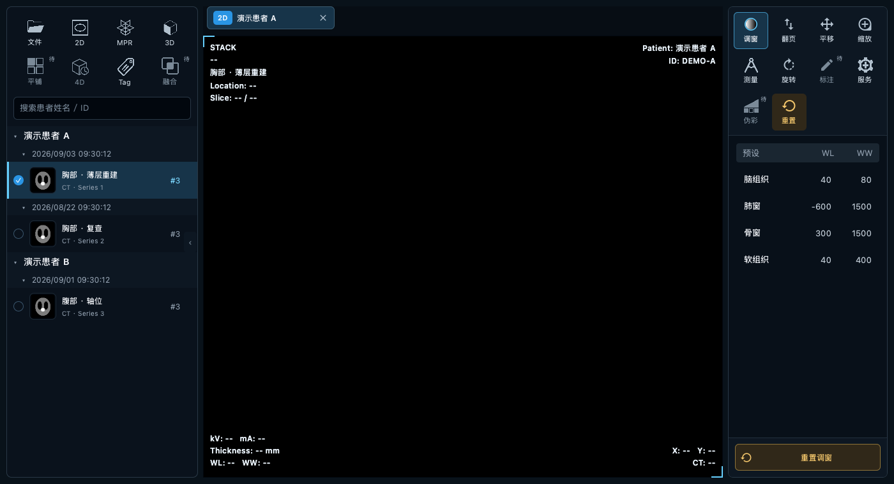
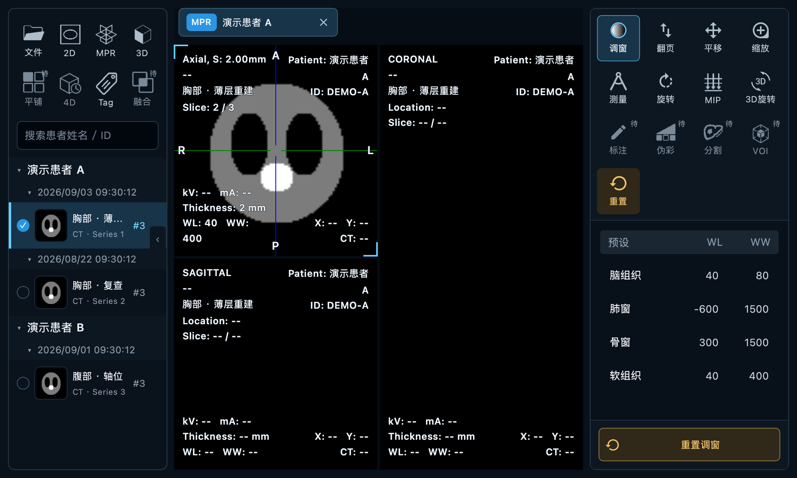
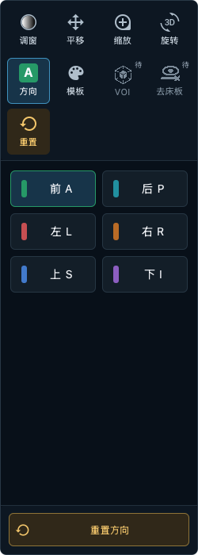

# 界面一致性检查 · 2026-09-06

修改位置：主项目 `/Users/jun/Documents/git-repo/qt-dicom-viewer`，没有新建 worktree。

## 结论

界面保持统一的深色医疗工作站风格：灰蓝色普通工具、青色选中态、琥珀色重置。图标不另加装饰外框，只在悬停、选中和键盘焦点时反馈状态。PNG 图标仍为各自独立文件，沿用前一轮设计，没有重新拼图。

MPR、VOI、融合等专业符号不能仅靠形状保证首次识别，所以两侧都增加了短文字名称和完整悬停提示。与基础几何图标相比，少数生成图标的笔画仍存在光学差异；通过统一颜色、容器和显示尺寸控制，不声称所有图标的原始笔画完全一致。

## 占位范围

| 位置 | 待实现入口 |
|---|---|
| 左侧第二行 | 平铺、融合（顺序为平铺 / 4D / Tag / 融合） |
| 2D | 标注、伪彩 |
| MPR | 标注、伪彩、分割、VOI |
| 3D | VOI、去床板 |
| 4D | 标注、伪彩 |
| 服务面板 | QA |

占位按钮禁用，带“待”标记；悬停说明“待实现”。点击不会切换当前工具、创建视图或触发处理。4D 因所选序列不支持而不可用时，显示具体数据原因，不标为“待实现”。融合也不模拟加载或创建空白标签页。

## 已调整

- 共用 `ToolbarAction.qml`，右侧图标 24px、导航图标 28px，短标签 11px；按钮高度 58px。
- 工具栏取消禁用态的重复透明度衰减。普通图标 `#b0bfcc` 与工具栏 `#0d1722` 对比度约 9.6:1；禁用前景 `#7b8b99` 约 5.2:1。这是配置颜色的计算值，不代表每个抗锯齿边缘像素，也不是完整无障碍认证。
- PNG 着色及调窗画布按屏幕像素密度绘制，再映射回逻辑尺寸，改善 Retina / 2 倍缩放下的边缘清晰度。
- 禁用提示由外层悬停区域提供，避免禁用按钮永远无法显示提示。
- 明确按钮的无障碍名称、不可用说明，恢复无边框工具栏的键盘焦点反馈。
- 空状态使用同一文件 PNG；标签页关闭按钮使用同一图标组件，并支持焦点显示。
- 调窗预设表明确使用 13px 字号，不再依赖平台默认字号。
- 右侧详情面板上下留白从合计 80px 缩减为 24px，保留内容滚动；边框和圆角与左侧面板协调。

## 保留的有意义差异

- 调窗图标的灰度渐变用于表示窗宽窗位，不作为装饰材质。
- 3D 方向字母、MPR 方向颜色、测量覆盖层与 MTF 曲线颜色属于数据/方向语义，未强行改为单色。
- 3D 调色板表示体渲染预设，伪彩使用 LUT 图标，避免两个入口混淆。
- 图像上的患者信息、方向、数值未因界面美化而隐藏或改写。

## 检查方法

使用真实 QML 组件截图与事件测试，不是设计稿模拟。检查了主窗口的无打开视图状态、2D、MPR、Tag，在 1400×760 / 1000×600 下的布局；另检查 2D / MPR / 3D / 4D 右侧工具栏的 220 / 250 / 280px 宽度，及服务、MTF、方向、模板、播放面板。

新增测试覆盖：占位的视图类型分配、禁用点击不改变状态、禁用悬停提示、按钮不越界、短标签不省略，以及融合/平铺不会创建标签页。测试数据为合成影像，不含真实患者信息。这里只验证界面与已有交互，不表示新图像处理功能已经实现，也不评价诊断或算法精度。

验证结果：全套 439 项测试通过（仅 VTK / NumPy 的已知弃用警告）；面板边距调整后，14 项界面/3D 面板测试通过；高 DPI 修正后，2 倍缩放的 PNG 着色与完整图形、主窗口 2D / MPR / Tag 检查共 4 项通过。

## 实际界面截图

