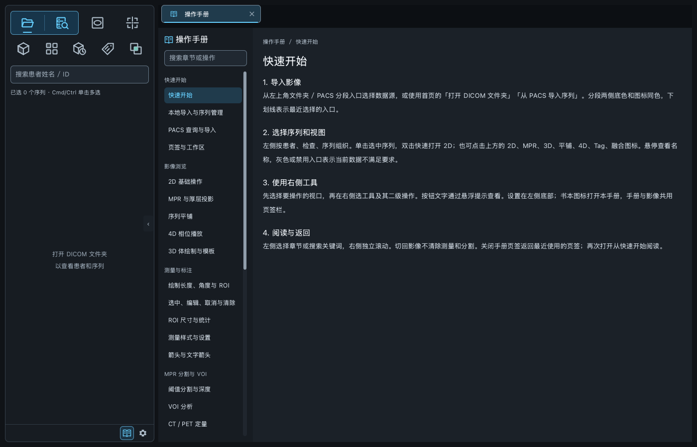
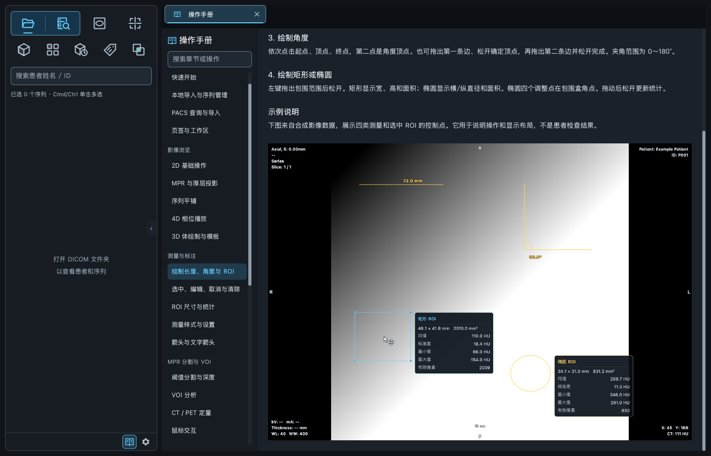
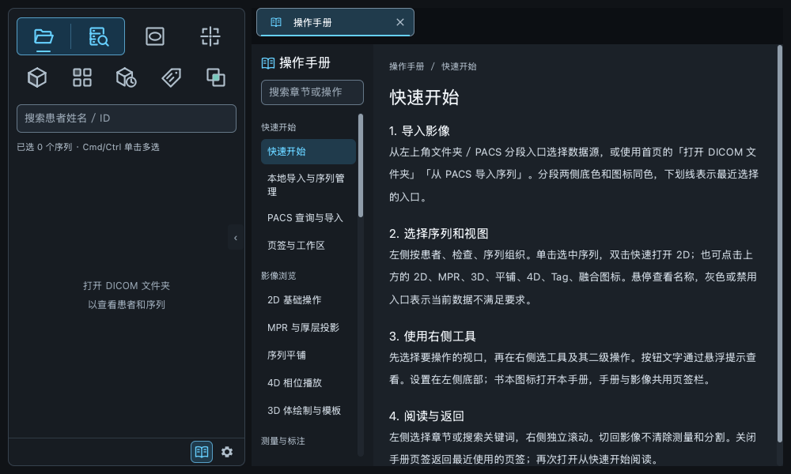

# 离线操作手册

左侧底栏设置按钮左边的书本图标打开「操作手册」页签，按钮 28×28 px、图标 18 px，间距 4 px，底栏仍为 32 px。无需导入影像即可阅读。测量、MPR 分割和 VOI 面板提供相同的帮助入口。

## 阅读方式

- 底栏首次打开显示「快速开始」，再次打开复用唯一页签并保留章节与阅读位置。
- 工具面板的帮助直接打开对应章节页首；左侧目录可搜索章节名称和正文关键词。
- 目录与正文独立滚动。普通页签切换保留章节、搜索与正文位置；影像控制器继续保存原来的视角、测量和分割状态。
- 关闭手册返回最近使用的剩余页签，关闭后台手册不改变当前页签。重新打开已关闭的手册回到快速开始。
- 手册不显示影像操作工具，也不作为 PNG / DICOM 影像导出对象。

平铺中的单张切片通过双击打开对应 2D 页签，并定位到该层、沿用当前窗值和反白状态。Tag 页签双击标签查看完整值，详情按内容调整高度，长值可滚动、选择和复制。

3D「裁剪」使用独立裁剪图标，与 MPR 分割区分；其光标为指针加相同裁剪图形。十字线旋转使用指针加十字和弧形箭头。

## 内容目录

| 分类 | 内容 |
| --- | --- |
| 快速开始 | 拖拽文件 / 压缩包 / 文件夹 / PACS 导入、数据源入口、查询、序列选择、页签 |
| 影像浏览 | 2D、MPR、厚层投影、平铺、4D、CT/PET 独立 3D 与显示裁剪 |
| 测量与标注 | 四类测量绘制、选中和控制点编辑、整体移动、取消/删除、统计与样式、箭头和文字 |
| MPR 分割与 VOI | 阈值和深度、球体/椭球、CT/PET 定量、鼠标优先级、范围管理 |
| PET 与融合 | 单位选择、配对预览、身份确认、手动配准 |
| 服务分析 | MTF 微珠/细丝、FFT/拟合、单层水模 QA、结果边界 |
| 显示设置 | 即时数值联动、分类恢复、伪彩、十字线、四角信息、比例尺 |
| 导出与常见问题 | PNG 实际画面、原始 DICOM、取消/失败、禁用原因与未支持功能 |

测量示例来自合成影像，通过真实 QML 绘制四种测量，包含矩形控制点与 ROI 信息卡。ROI 使用模态像素统计，宽高统一开关且与面积同行；显示样式持久化，测量对象只在影像页签会话中保留。

当前未支持 DICOM SR 测量保存、SEG/RTSTRUCT 导入导出、自由手绘三维分割或分割表面生成。3D 页签的 VOI 仍为禁用占位；实际范围绘制位于 MPR 切面。MTF 与水模 QA 是分析结果，不自动判定设备合格。

## 维护与资源

章节、目录、步骤和说明集中在 `src/qt_dicom_viewer/qml/assets/help/manual.json`，按 `categories` / `chapters` 组织；章节的 `sections` 存放标题与正文。图片字段为 `example` 或 CT/PET 两项 `examples`，几何示意通过 `figure` 选择，光标图例由 `cursorLegend` 启用。

`ManualTabController` 管理搜索、章节与会话内滚动位置；`WorkspaceController.openManual(chapterId)` 负责唯一页签和章节跳转。页面 `sections/manual/OperationManual.qml` 使用项目 Theme 和 SVG 图标入口。全部 JSON、SVG 和 PNG 列于 QRC，并随 Python 包的 QML 目录打包；无需联网。

增加章节时同时检查导航 ID 唯一、图片路径、QRC 和文案与实际行为一致。不要将占位按钮或待实现能力写成已支持。

## 验证与截图

`tests/test_manual.py` 覆盖资源完整性、SVG 两种尺寸、无影像入口、唯一页签、搜索、阅读位置、章节直达、关闭返回、1000×600 / 1400×900 布局、MPR 测量与分割状态保留，以及 3D 控制器状态。3D 测试隔离原生 GPU 窗口；真实 VTK 渲染由项目单独的原生测试验证。

`tests/test_mpr_voi_qml.py` 验证 CT/PET 分割与 VOI 的实际鼠标操作和上下文帮助；测量、PACS、导出与页签回归沿用各专项测试。

水模 QA 标题旁的手册入口直接定位 `water-qa` 章节，包含加载与识别、ROI 参数与拖动、各项 HU 指标公式、统计表、切片缓存、重置及失败处理。说明集中在手册中，QA 面板不再提供逐项说明弹窗。

0.4.0 增加拖拽与压缩导入，具体格式、缓存与取消行为见 [本地导入](local-import.md)。窗宽、窗位的显示、手动应用与模板保存最多保留一位小数，整数不显示 `.0`。
