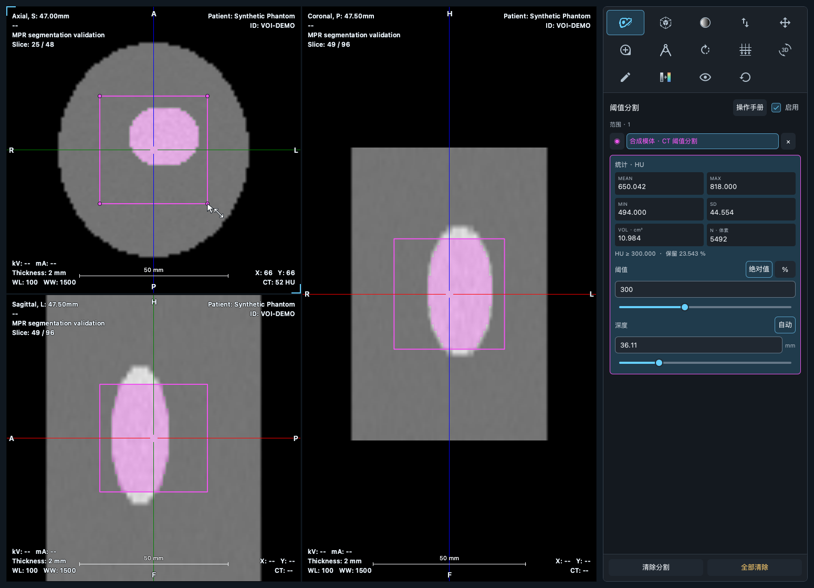
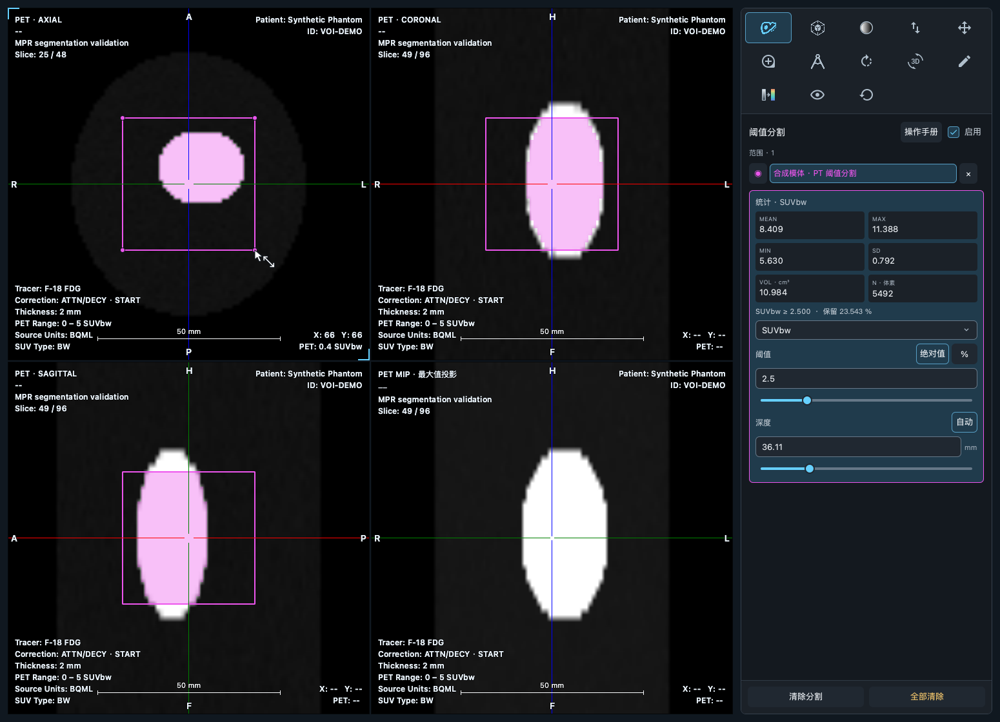
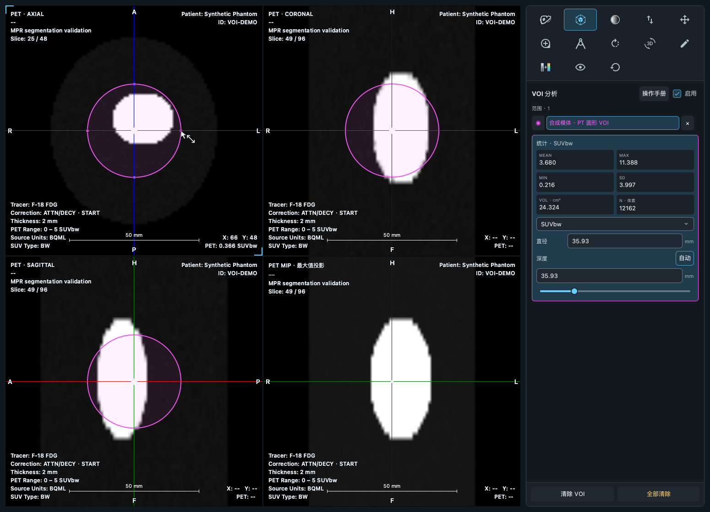

# MPR 分割与 VOI

在 CT 或静态 PET 的 MPR 标签页选择「阈值分割」或「VOI」，启用后在轴位、冠状位、矢状位任一切面绘制。分割使用矩形柱体，VOI 使用圆形选区对应的球体/旋转椭球。深度表示沿绘制切面法线向两侧延伸的总厚度，单位 mm。开启工具会关闭厚层投影和手动配准，使绘制依据当前实际切面。

点击标题旁书本图标，在工作区「操作手册」页签打开对应章节。左下角设置旁也可打开完整手册，无需先加载影像。八类目录包含快速开始、影像浏览、测量、MPR 分割与 VOI、PET 与融合、服务、设置、导出与常见问题。

手册正文独立滚动，章节可搜索；工具入口跳到章节页首，底栏再次打开保留阅读位置。切换回影像时范围与测量保留；关闭手册返回最近使用的页签。所有图文随应用打包，离线可用。详见 [操作手册说明](manual.md)。

## 绘制与编辑

- 分割：按下并拖动矩形。自动深度为 `√(宽 mm × 高 mm)`，最小为当前法线方向的采样间距。32 × 18 mm 的选区默认深度为 24 mm。调整宽高时自动深度同步变化。
- VOI：按下确定圆心，拖动确定半径，支持水平或垂直拖动。圆形按物理毫米计算，默认深度等于直径，形成球体。直径可以数值输入或拖动圆周修改。
- 输入或拖动深度后进入手动模式，后续调整矩形宽高或圆半径保留该深度。点击「自动」恢复跟随。VOI 手动深度与直径不同时形成旋转椭球；绘制切面仍为圆形。
- 在原绘制切面拖动区域内部移动，矩形拖动角点调整宽高，圆形拖动圆周或四个控制点调整半径。其他切面显示真实截面；球体/椭球截面随翻页逐渐缩小，离开区域后消失。
- 分割采用 `值 ≥ 阈值`，阈值支持数值输入和滑块。VOI 统计球体/椭球内全部有效体素。三视图轮廓对应同一物理区域，分割还叠加当前切面内满足阈值的体素。

## 面板和管理

右侧使用紧凑的两列三行统计，显示 MEAN、MAX、MIN、SD、VOL、N；单位集中显示，分割额外显示保留率。列表最多显示四行，更多范围可滚动查看；名称在列表中双击编辑，不重复显示描述输入框。操作说明集中于内置手册。

阈值标签与绝对值 / 百分比按钮占一行，数值输入独占下一行；深度标签与自动 / 手动按钮占一行，深度输入和单位占下一行。模式按钮保留完整文字宽度，输入框随侧栏宽度伸缩。界面测试覆盖 260、300、390 像素侧栏，手册覆盖 1000 × 600 与 1400 × 900 的工作区窗口。

可绘制多个分割和 VOI，切换工具后保留已有范围。列表选择会切换到对应工具。底部原重置栏在分割工具下显示「清除分割 / 全部清除」，在 VOI 工具下显示「清除 VOI / 全部清除」；按钮不随内容滚动，没有对应范围时禁用。「全部清除」仅影响当前 MPR 标签页。其他工具继续显示对应重置操作。

Esc 取消当前绘制/编辑，Delete 或 Backspace 删除选中范围。关闭「启用」隐藏所有范围并暂停绘制，保留结果。在输入框编辑时，先将焦点移回图像再使用删除快捷键。

## 鼠标交互与拖动

光标统一由 `CursorPolicy.js` 按命中目标决定，使用专用矢量 `CursorGlyph.qml`，不再复用工具栏异步加载的图片或不透明徽标。指针尖端始终是热点。拖动起点重新命中确认，拖动期间锁定光标，松开和切换工具后刷新，离开视口清除旧命中。

| 操作或命中目标 | 光标提示 |
| --- | --- |
| 调窗 | 半明半暗圆 |
| 缩放 | 放大镜 |
| 翻页 | 上下翻页箭头 |
| 图像平移、已选范围内部或测量轮廓移动 | 四向箭头 |
| 分割 / VOI 空白处绘制 | 矩形 / 圆形 |
| 分割角点、VOI 圆周与控制点 | 尺寸调整箭头 |
| 测量和标注绘制、测量控制点编辑 | 精确十字光标 |
| 十字线中心移动 | 带中心圆的十字 |
| 十字线线段旋转 | 带十字的环形箭头 |
| 整体三维旋转 | 带旋转箭头的立方体 |

优先级与实际操作一致：分割 / VOI 模式下由范围工具接管；其他 MPR 工具下十字线中心或线段优先于测量编辑和当前图像工具。文本标注直接接管点击，不被十字线覆盖。

拖动期间只更新区域轮廓，未变化的轮廓和分割遮罩按视口与几何复用。轮廓的 QML 对象随拖动保留，避免每帧重建；范围列表与统计面板不接收每次鼠标移动。松开后才重新计算该范围的三维统计和分割着色；编辑取消则恢复原结果。后台计算仍使用版本淘汰，避免过期结果覆盖新参数。

## CT / PET 定量

CT 使用 Modality LUT / rescale 后的 HU；PET 使用体积加载器提供的可靠定量单位：可用时为 SUVbw 或数据原生 SUV 类型，否则保留 Bq/ml、kBq/ml 或原始模态单位。不根据屏幕灰度、RGB、窗宽窗位或 PET MIP 计算统计。

PET 每个范围可独立选择定量单位，显示强度单位与 VOI 定量单位独立，调窗和切换显示单位不改变保存的阈值。不同切片的 SUV 因子可能不同，因此切换 VOI 定量单位不会按一个全局因子换算绝对阈值：SUV 阈值重置为 2.5，源活度阈值重置为 0，请重新设置。百分比数值在单位切换后保留，并在新单位数据上重算。PET 百分比以当前 VOI 最大值为基准；CT 百分比在当前 VOI 最小值至最大值区间取阈值，兼容负 HU。这些规则在操作手册中说明。

统计按原始三维网格的体素中心采样。矩形柱体采用下界包含、上界不包含的约定；球体/椭球按二次曲面方程选取内部及边界上的体素中心。排除 padding、非有限值及数据覆盖外的位置。SD 为总体标准差；体积为体素数乘以物理体素体积，从 mm³ 换算到 cm³；保留率为分割体素数除以选区内有效体素数。空结果的体积和 N 为 0，强度统计显示 `--`。

几何使用患者 LPS 坐标，支持各向异性间距、倾斜 MPR 和视口平移、缩放、翻转、旋转。椭球轮廓通过将三维二次曲面限制到当前切面求得，不是包围盒或最大截面的投影。计算在后台合并连续参数修改，仅接受当前版本结果；中间数组逐层处理，掩膜仅保存区域的包围范围。分割掩膜按最近邻显示在当前切面。

PET/CT 融合复用同一能力：在 CT 格绘制使用 CT 定量，在 PET/融合格绘制使用 PET 定量，轮廓保存在 CT 患者坐标系，PET 按已接受的刚性变换参与采样。

## 当前范围与验证

本版支持矩形柱体范围内阈值分割、球体/旋转椭球 VOI。范围保存在当前标签页内，关闭标签页后清除。尚不提供自由手绘、连通域生长、分割三维表面或 DICOM SEG/RTSTRUCT 导入导出。PET MIP 是投影视图，不支持绘制和三维定量；请使用另外三个切面。

- `tests/test_mpr_voi.py`：各向异性体积、负 HU、padding、SUV/活度、自动深度公式、圆形物理尺寸、倾斜椭球统计、真实截面随切面移动缩小/消失。
- `tests/test_mpr_voi_controller.py`：异步版本淘汰、编辑取消、自动/手动深度、圆周调整和直径输入、显隐/删除、失败重试与源数据坐标变更；连续 60 次拖动不重生成静态遮罩、不刷新统计与列表，悬停和按下使用同一命中结果。
- `tests/test_mpr_voi_qml.py`：真实 QML 鼠标/键盘事件验证 CT/PET 绘制、移动、数值输入、单位切换、列表改名、窄面板无重叠、光标状态和固定底部清除操作；分割与 VOI 的帮助入口路由至对应工作区章节，不改变范围。
- `tests/test_manual.py`：唯一页签、无影像入口、搜索、章节定位、阅读位置恢复、关闭后的最近使用页签、全部章节与打包资源、宽窄布局，以及影像状态保留。
- `tests/test_measurement_qml.py`：测量光标、拖动锁定和统一光标优先级矩阵，检查所有自绘操作光标均有矢量路径。

```bash
PYTHONPATH=src QT_QPA_PLATFORM=offscreen QT_QUICK_BACKEND=software uv run pytest -q
```

验证使用合成 DICOM，不包含真实患者数据验收。手册图片保存在 QML 资源目录，随应用打包，可离线查看。

## 合成数据预览








