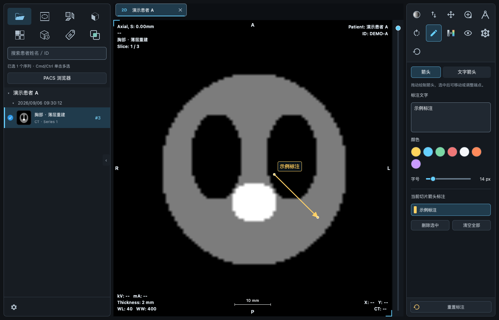
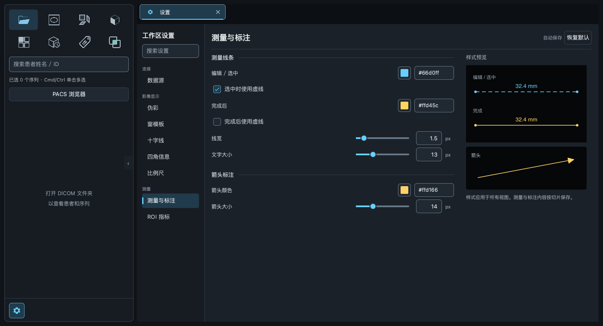
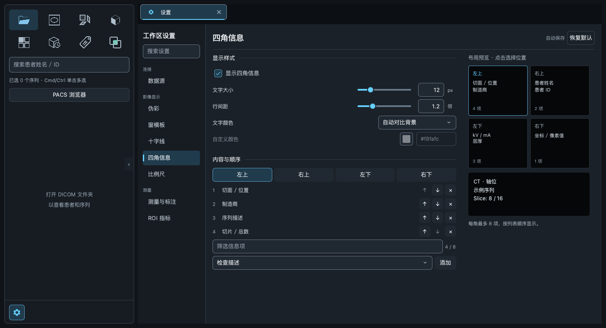
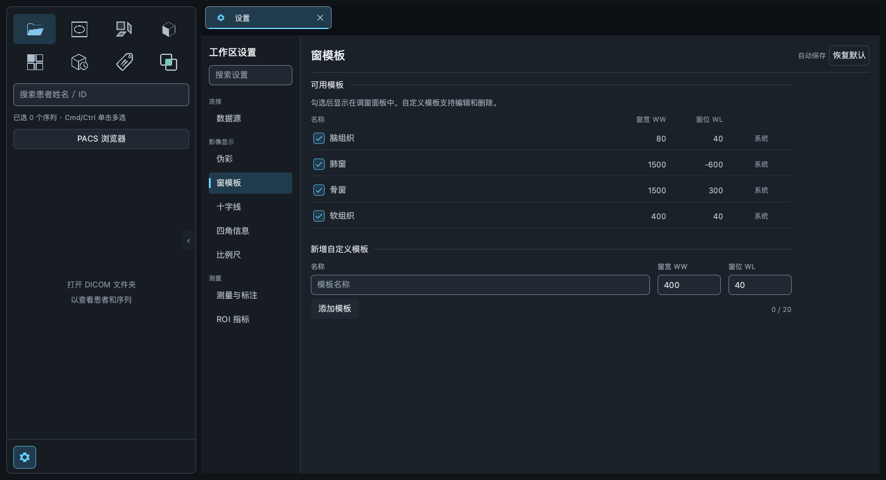
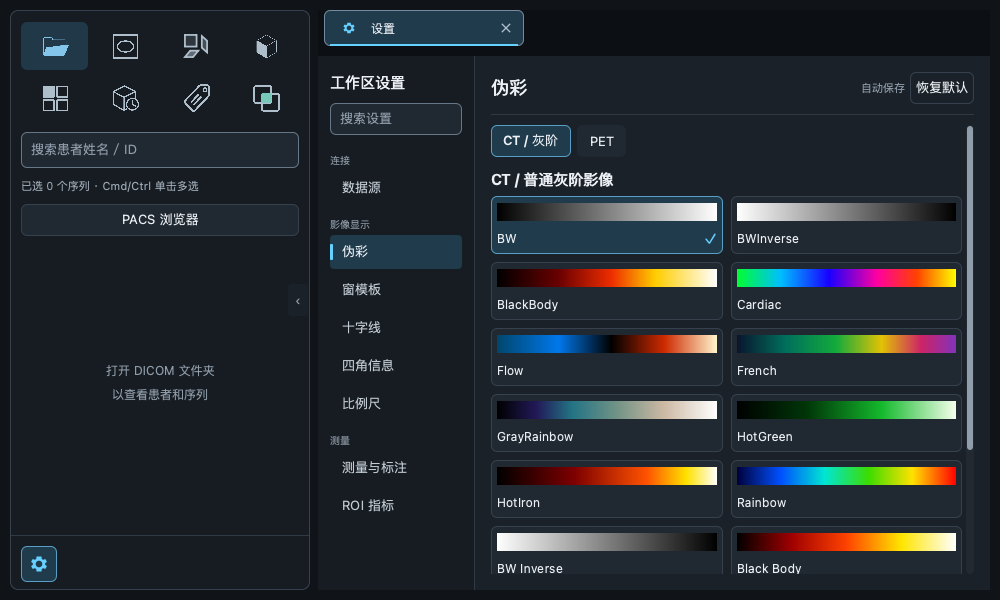
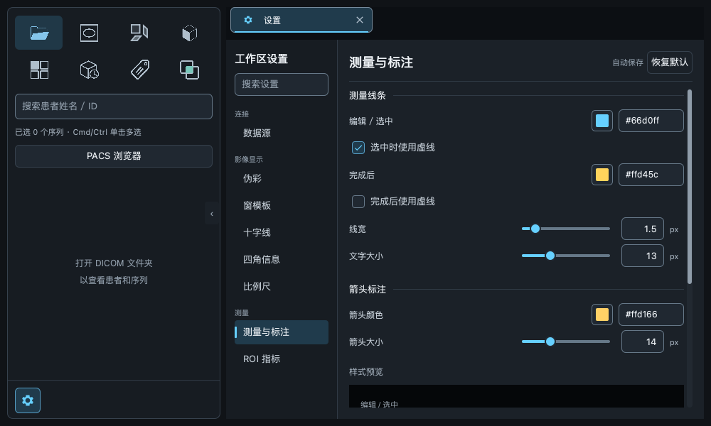

# 影像工作区样式审核与优化

2026-09-06 · `codex/imaging-ui-polish` · 基于 `main@4093984`

本轮根据最新截图重新设计 MPR、伪彩图标和设置结构，并复查工具栏内容区。截图使用合成测试影像。

## 本轮调整

| 区域 | 最终设计 |
|---|---|
| MPR | 三个分开的矩形切面，分别表达正面、侧面和水平面；取消交叠外轮廓。使用 Qt Quick 几何图形，24 / 28 px 及放大后保持清晰。 |
| 伪彩 | 左侧灰阶、右侧色带，中间箭头表达映射关系。普通伪彩和灰阶伪彩入口共用图形。 |
| 文件入口 | 改用冷蓝色 `#85c6ec` 和低亮度蓝灰背景 `#203847`；融合交叠区保留青绿色。 |
| 设置导航 | 156 px 单行分类导航，按连接、影像显示、测量分组；选中项使用细色条，八个分类在 1000 × 600 窗口内可见。 |
| 设置表单 | 参数区与预览区分开，预览最多 280 px；内容区不足 720 px 时上下排列。使用分节线代替多层大卡片。 |
| 颜色与数值 | 默认显示色块和十六进制色值，点击色块展开色板；滑块旁可直接输入数值，无效输入离开焦点后恢复已有值。 |
| 测量与标注 | 测量线条、箭头两个参数组，右侧提供短线、端点、读数与箭头预览。 |
| 四角信息 | 选择一个角后编辑内容和顺序；提供四角布局预览及数量，已选字段从可添加列表中排除。保留每角最多 8 项。 |
| 窗模板 | 对齐名称、WW、WL 和操作列；新增与编辑表单同行排列，数值输入框限制为 100 px，页面最多 760 px。 |
| 十字线、比例尺、ROI | 共用参数与预览布局；预览使用已有的实际显示组件，样式与工作区同步。 |

延续此前调整：两侧主工具栏只显示图标，操作名称通过悬停与键盘焦点提示显示；4D 与其他导航图标同色；设置入口为 36 × 36 px；基础控件为 32 px。标注长文本滚动、色块换行、QA 参数换行与 PET 内容区适配仍保留。

影像灰阶与伪彩映射、MPR 方位颜色、测量单位和计算逻辑未作修改。

## 验证

- 全量回归：`721 passed, 15 skipped`（103.31 秒）。跳过项需要显式启用真实 PACS 环境；582 条警告来自现有 VTK / NumPy 弃用提示。
- 最后调整色块内边距后，设置、工具内容区、图标和平铺相关回归：`47 passed`（22.92 秒）。

- 资源清单 105 项存在且不重复，所有 QML 均登记；Qt RCC 编译通过。
- `git diff --check` 通过；QML 回归未记录加载或运行时告警。
- 测试环境为 macOS、Qt 软件渲染。Windows 实机外观未在本轮验证。

新增 `tests/test_settings_redesign.py` 验证实际操作和渲染结果：

- 四角切换、预览选择、排序、移除及添加。
- 色板打开、选色、关闭和 Escape 操作，更新实际控制器值。
- 数值输入、滑块键盘操作和无效输入恢复。
- 1000 / 1400 / 2000 px 窗口下的表格列对齐、模板保存、编辑和删除。
- 宽窗口下预览列的边界，以及参数控件的位置。
- 24 / 28 / 48 px 下 MPR 三个切面分离，伪彩图标同时具有灰阶与冷暖色带。

原有界面回归继续检查 220 / 250 / 280 px 工具内容区、1000 × 600 设置页、长标注文本、禁用提示和滚动条。主回归还覆盖影像导入、MPR、融合、测量、调窗和 PACS 模拟服务。

按主题 sRGB 值计算，次级文字 / 控件背景对比度为 9.17:1，普通图标 / 面板为 9.11:1，文件夹图标 / 对应背景为 6.57:1。

## 最终截图

工作区：



测量与标注：



四角信息：



窗模板：



窄窗口伪彩与标注设置：





## 运行

```sh
cd /Users/jun/Documents/git-repo/qt-dicom-viewer-ui-polish
PYTHONPATH=src /Users/jun/Documents/git-repo/qt-dicom-viewer/.venv/bin/python -m qt_dicom_viewer.app
```

验证命令：

```sh
QT_QPA_PLATFORM=offscreen QT_QUICK_BACKEND=software PYTHONPATH=src \
  /Users/jun/Documents/git-repo/qt-dicom-viewer/.venv/bin/python -m pytest -q
```

当前样式分支保持独立，供后续审阅与合并。
