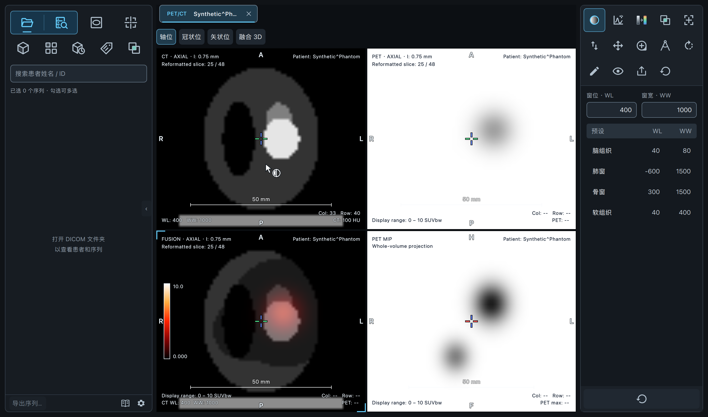
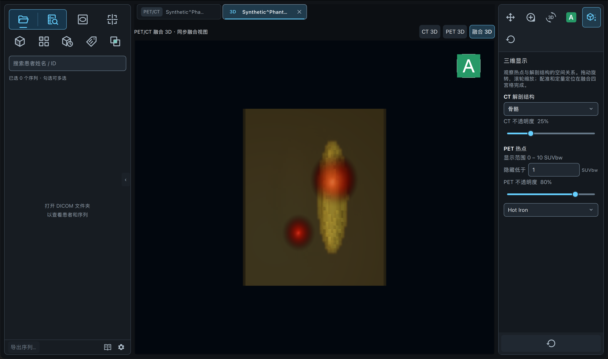

# 全分支合并验证

2026-09-08，在本地 `main` 完成合并；代码合并提交为 `0e004de`。合并前 `main` 为 `5f88a46`。已获取远端引用，远端只有 `origin/main`，其提交已包含在本地历史中。本次没有推送远端。

三个功能 worktree 原本均有未提交修改，已先备份、提交到各自分支，再逐一合并。主目录原有的 17 个未跟踪 MTF 验证文件逐字节核对保持不变，未纳入此次合并。

| 分支 | 保存最新修改的提交 | 合并到 main 的提交 |
| --- | --- | --- |
| `codex/export` | `0706d4a` | `bd27ace` |
| `codex/mpr-segmentation-voi` | `c2c3862` | `9d5bc86` |
| `codex/pet-fusion-workflow` | `74d0eb8` | `0e004de` |

所有本地分支的最新提交均通过祖先检查，三个来源 worktree 均干净。详见 [Git 核对记录](git-verification.txt)。

## 合并修复

- 原 main 的视口截图 / 原始 DICOM 导出与 export 分支的整序列导出使用了同名控制器。保留两个工作流，将整序列任务独立为 `SeriesExportController`，右侧原有导出及左侧新增序列导出均可用，任务状态相互独立。
- 保留 main 已完成的紧凑侧栏、手册入口和融合候选缩略图布局，同时合入 PET 分支的同患者互补模态筛选、人工配对开关及不可用候选禁用逻辑。异步缩略图刷新保留选中项和人工确认状态。
- PET 重建结果同时保留新影像内容版本和 MPR 定量所需体数据引用；融合工具列表保留导出，普通 MPR 保留分割与 VOI。
- 修复 2D/3D 切换时的 QML 更新顺序问题：切出中的二维组件不再接收三维控制器。新增真实 QML 反复切换、关闭和重开测试，原生检查没有 QML 警告。
- 保留 PET 定位标记命中优先规则。VOI 回归从标记外的范围内部及圆周进行移动、缩放，继续断言几何、定量及光标行为；人工跨患者配对测试显式打开其他患者选项。MTF 测试使用真实 2D 工具范围，避免无工作区限制的测试工具栏引入无关 PET 按钮。
- 更新离线手册、README 和 MPR 文档，使三维松开即裁剪、CT/PET 独立调窗、固定联动、融合 3D、定位与匿名序列导出的说明与合并后功能一致。

## 检查结果

| 检查 | 结果 |
| --- | --- |
| 全量回归 | **867 passed, 15 skipped**，158.70 秒 |
| 资源 | 178 个唯一资源完整，95 个 QML 组件从编译后的 `.qrc` 加载为 Ready |
| Python | 190 个应用、脚本与测试文件解析通过，无意外重复方法 |
| 原生 CT 3D | 六方向、六模板、调窗、旋转 / 平移 / 缩放、去床板、内外裁剪、重置、窗口缩放和标签切换通过 |
| 原生 PET 3D | CT / PET / 融合 GPU 体绘制、相机与参数保留、配准同步、缓存复用、源页关闭后的快照、标签隐藏 / 关闭 / 重开通过 |
| Git | 无残留冲突；`git diff --check` 通过；所有功能分支已包含在 main |

[全量日志](regression.txt)、[资源检查](resource-check.txt)、[原生 CT 3D](native-3d.txt)、[原生 PET 3D](native-pet-3d.txt)。

跳过项为 14 个需要额外启动 Docker PACS 实验环境的用例和 1 个该环境内的原生桌面用例，没有计为通过。586 条警告包括 585 条 VTK / NumPy 数组形状接口弃用提示，以及 1 条匿名导出测试有意构造未知 DICOM 标签的 VR 提示。普通原生 3D 与 PET 融合 3D 已另行执行，不替代跳过的 PACS 端到端检查。

全量回归命令（在仓库根目录，PACS 单元测试需要允许本机临时 HTTP 服务）：

```sh
PYTHONDONTWRITEBYTECODE=1 QT_QPA_PLATFORM=offscreen PYTHONPATH=src \
  .venv/bin/python -m pytest -q -r s -p no:cacheprovider \
  --basetemp=/tmp/qt-merge-final-regression --tb=short
```

原生验证执行 `tests/manual/smoke_3d.py` 和 `tests/manual/smoke_pet_3d.py` 的 `main()`；启动包装器将 `bind_controller` 替换为使用 `settings_path=False`、临时 PACS 配置与导入目录的同一 `AppController`，避免修改用户设置。使用本机 macOS Qt / OpenGL 和合成数据，截图为 48×64×64 合成 CT/PET，不代表真实设备影像验证。本轮重新运行定位性能回归，完整规模的性能基准仍参见 [PET 工作流原始验证记录](../pet-fusion-workflow/README.md)。

## 合并后截图




