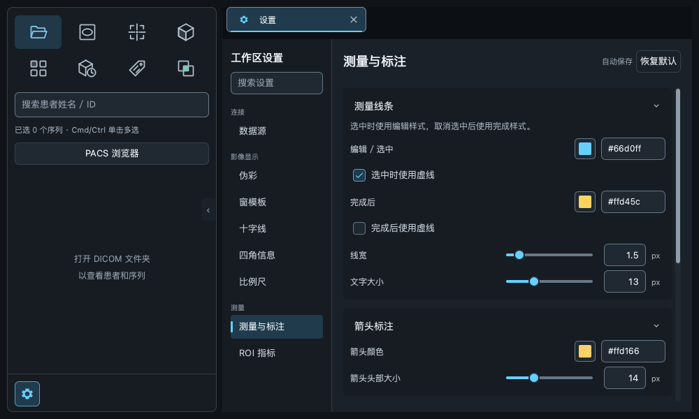
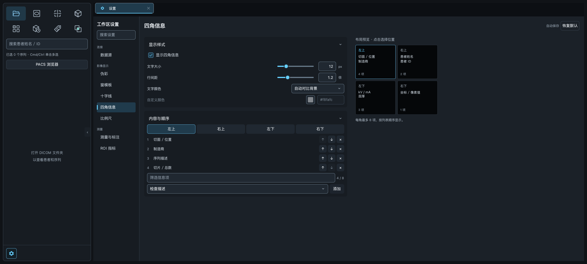
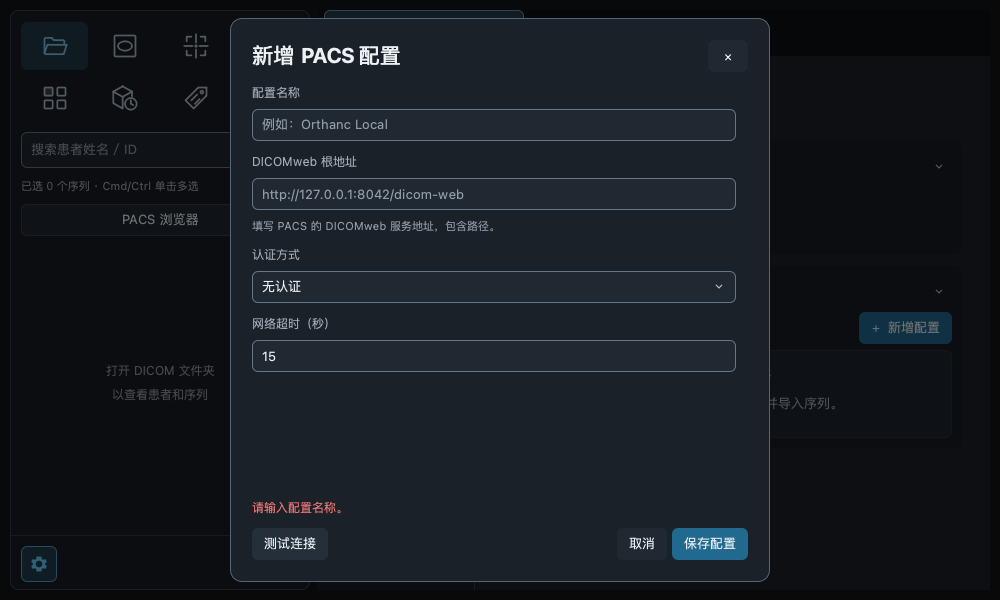
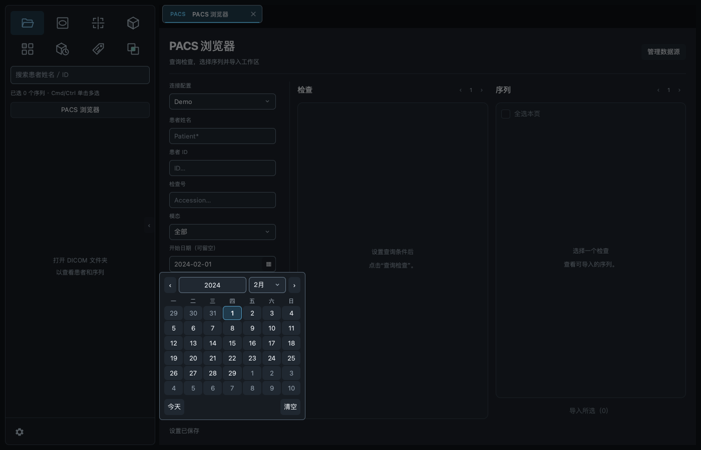
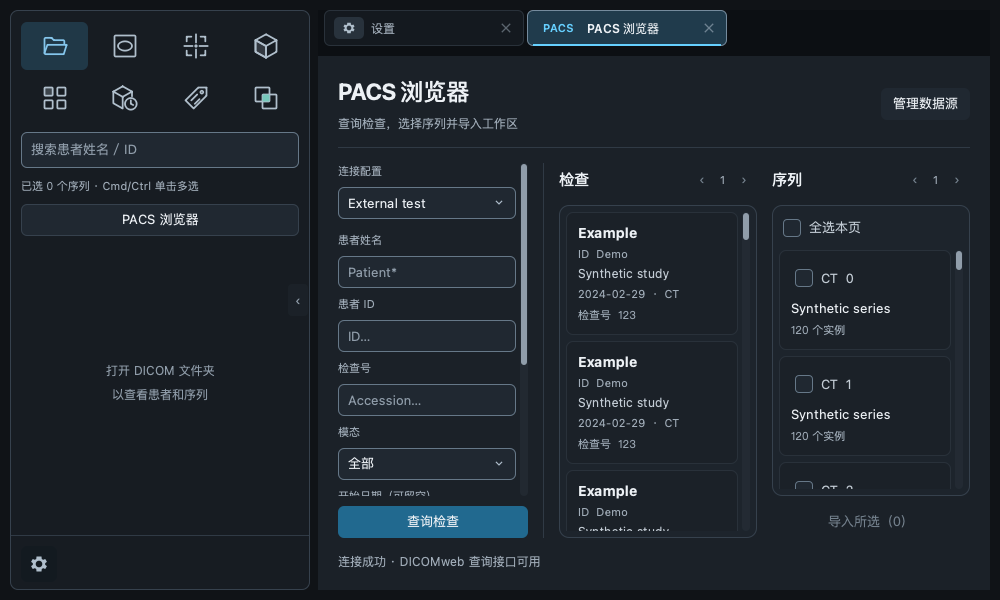

# 设置与工作区交互复核

本次修改位于 `codex/imaging-ui-polish`，基于现有样式工作树。

## 实现

- 设置内容使用低对比折叠分组。默认展开，切换分类后保留会话内折叠状态；数据源两个开关同行。
- 数值输入与滑块共享值：有效输入即时生效，空白和未完成输入不提交，失焦或 Escape 恢复有效值；外部修改和恢复默认同步正在聚焦的输入框。
- 四角选择和预览共用唯一选择状态；鼠标焦点不再显示为第二个选中框。移除无意义的固定 CT 样例。
- PACS 连接列表、详情弹窗分别显示测试中、成功、失败或取消。结果按连接／草稿隔离，修改配置后失效；详情反馈固定在按钮上方，保存失败同处提示。
- PACS 日期支持手动输入、日历年月选择和清空；使用本地日历年月日构建 ISO 日期，避免时区偏移。后台继续校验起止范围。
- PACS 筛选、检查、序列列表预留 12 px 滚动区域；不遮挡内容。
- 比例尺默认 100 mm（10 cm），提供 1、10、20、50、100 mm。旧配置自动补齐。缩放时按真实物理间距计算；放不下时降到可容纳的较短预设，无有效标定则隐藏。
- 左上八个图标改为 SVG，通过 QtSvg 按设备像素密度渲染并缓存，统一着色；文件夹采用冷蓝色，融合交叠区使用青绿色。视图提示统一为名称。
- 关闭活动页签后激活最近使用的剩余页签；关闭后台页签保持当前页签，视觉排列顺序不变。

## 验证

最终完整回归：**744 passed，15 skipped**；582 条为既有 VTK／NumPy 弃用警告。最后的连接提示去重调整后，13 项交互专项再次全部通过。

专项测试覆盖实时数值联动、聚焦时恢复默认、折叠状态保留、四角焦点、连接认证失败／超时／取消／过期结果、短窗口反馈、日历闰年选择与清空、比例尺真实长度及降档、MRU 页签关闭、SVG 1×／2× 渲染和 PACS 滚动间距。

连接测试使用本地合成 DICOMweb 服务与受控超时，不依赖外部 PACS 可用性。已有测量样式、ROI 宽高联合开关及实际标注渲染测试纳入完整回归。Qt RCC 资源编译通过。

## 界面截图

